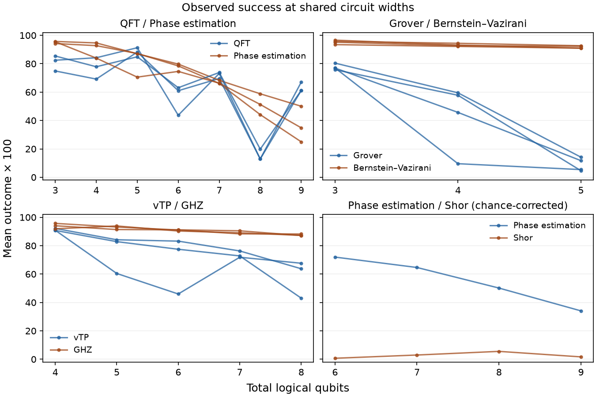

# Do related circuits lose success in the same way?

Backend ibm_fez. The cohort contains 1,236 jobs and 189 configurations in 9 collection periods.

[Linear fits, target definitions, and comparison table](trend_review.md)

[All algorithm pairs and exploratory decay groups](groups/report.md)

Each comparison uses exact resource values observed for both algorithms in the same campaign and window. At each resource value we average repetitions within each configuration, then give each configuration equal weight. At least three shared values are required. Each value has equal weight in the descriptive straight-line slope.

Spearman rho measures whether the observed success means rank the shared resource values similarly. The slopes show the direction and average size of change per unit. Step-rate Spearman rho ranks the observed changes per resource unit between adjacent levels and compares those ranks when at least three intervals exist. The adjacent-interval counts show how often both workloads actually decline or rise over the same step. A high rho can accompany very different slopes. Correlating two fitted nonconstant straight lines on the same grid would always give +1 or −1.

Error is one minus success, so the raw error slopes have the opposite signs and the same magnitudes. Normalized comparisons use (success − chance) / (ideal success − chance) wherever the denominator exceeds 1e-8.

## How far apart are the fitted losses?

The gap is 100 × |slope A − slope B| × (largest − smallest shared level): the difference in fitted change over the shared range, in target points. Each pair is read on success, except pairs involving Shor, which are read on chance-corrected success because Shor's raw success falls with its chance floor. The table gives the median gap across eligible periods with a 95% bootstrap interval and the bootstrap probability that this median is within 5 points. An interval that straddles 5 supports neither similar nor different decay.

Bootstrap: 1000 draws; jobs are resampled with replacement within each configuration at each resource level (algorithm × level × configuration × period), so the set of configurations and levels stays fixed; deviations of a resampled configuration mean are scaled by sqrt(n/(n-1)) to offset the small number of repetitions, and a configuration with one job contributes no variation. This is not binomial shot resampling: it reflects job-to-job variation, which includes shot noise. Intervals are 2.5th to 97.5th percentiles.

### Total logical qubits

| Pair | Role | Outcome | Periods | Median gap [95% interval] | P(gap ≤ 5) |
| --- | --- | --- | ---: | ---: | ---: |
| BERNSTEIN-VAZIRANI / VTP | other | success | 3 | 3.87 [2.62, 5.72] | 0.87 |
| GHZ / SHOR | other | chance_corrected | 1 | 10.60 [7.20, 14.19] | 0.00 |
| QFT / PHASE-ESTIMATION | fourier | success | 3 | 11.75 [9.15, 18.43] | 0.00 |
| BERNSTEIN-VAZIRANI / SHOR | other | chance_corrected | 1 | 11.95 [10.56, 13.42] | 0.00 |
| BERNSTEIN-VAZIRANI / GHZ | other | success | 3 | 13.39 [11.75, 14.92] | 0.00 |
| QFT / SHOR | composition | chance_corrected | 1 | 14.11 [10.24, 17.86] | 0.00 |
| PHASE-ESTIMATION / VTP | other | success | 3 | 14.36 [11.88, 16.93] | 0.00 |
| QFT / RANDOM-VOLUMETRIC | control | success | 3 | 16.70 [12.33, 21.27] | 0.00 |
| VTP / GHZ | entanglement | success | 3 | 17.97 [16.35, 19.67] | 0.00 |
| BERNSTEIN-VAZIRANI / QFT | other | success | 3 | 22.37 [15.62, 28.08] | 0.00 |
| VTP / RANDOM-VOLUMETRIC | mirror_protocol | success | 3 | 23.35 [21.09, 25.57] | 0.00 |
| PHASE-ESTIMATION / RANDOM-VOLUMETRIC | control | success | 3 | 24.35 [22.03, 26.80] | 0.00 |
| QFT / VTP | other | success | 3 | 26.60 [23.38, 29.70] | 0.00 |
| BERNSTEIN-VAZIRANI / PHASE-ESTIMATION | other | success | 3 | 34.12 [32.12, 36.15] | 0.00 |
| GHZ / QFT | other | success | 3 | 37.30 [35.24, 38.96] | 0.00 |
| SHOR / VTP | other | chance_corrected | 1 | 37.91 [34.67, 40.83] | 0.00 |
| PHASE-ESTIMATION / SHOR | composition | chance_corrected | 1 | 40.09 [37.47, 42.68] | 0.00 |
| GROVER / RANDOM-VOLUMETRIC | control | success | 3 | 41.94 [39.97, 43.87] | 0.00 |
| GHZ / PHASE-ESTIMATION | other | success | 3 | 43.26 [41.48, 45.23] | 0.00 |
| SHOR / RANDOM-VOLUMETRIC | control | chance_corrected | 1 | 46.33 [45.01, 47.52] | 0.00 |
| BERNSTEIN-VAZIRANI / RANDOM-VOLUMETRIC | control | success | 3 | 46.48 [44.40, 48.48] | 0.00 |
| GROVER / PHASE-ESTIMATION | other | success | 3 | 57.60 [56.56, 58.69] | 0.00 |
| GHZ / RANDOM-VOLUMETRIC | control | success | 3 | 62.28 [61.13, 64.42] | 0.00 |
| GROVER / BERNSTEIN-VAZIRANI | oracle | success | 4 | 64.89 [63.76, 65.98] | 0.00 |
| GHZ / GROVER | other | success | 3 | 80.09 [79.25, 80.93] | 0.00 |
| GROVER / QFT | other | success | 3 | 83.16 [82.44, 83.86] | 0.00 |

### Logical two-qubit gates

| Pair | Role | Outcome | Periods | Median gap [95% interval] | P(gap ≤ 5) |
| --- | --- | --- | ---: | ---: | ---: |
| QFT / PHASE-ESTIMATION | fourier | success | 3 | 4.34 [1.66, 7.89] | 0.58 |
| VTP / GHZ | entanglement | success | 3 | 5.58 [3.71, 7.36] | 0.23 |
| GHZ / QFT | other | success | 3 | 10.52 [8.27, 12.93] | 0.00 |
| QFT / VTP | other | success | 3 | 16.09 [15.03, 17.15] | 0.00 |
| BERNSTEIN-VAZIRANI / QFT | other | success | 3 | 33.84 [31.58, 35.34] | 0.00 |
| BERNSTEIN-VAZIRANI / VTP | other | success | 3 | 34.29 [32.98, 35.41] | 0.00 |
| BERNSTEIN-VAZIRANI / GHZ | other | success | 3 | 37.33 [35.82, 38.93] | 0.00 |

## Do related pairs agree more often than unrelated ones?

Base rates over every resource, on each pair's primary outcome. A window is a point match when both fitted lines fall and the gap is at most 5 points. Mean P(match) averages the bootstrap probability of that event. A cell is one pair on one resource with at least two eligible windows; it repeats when two or more of its windows are point matches. Family = QFT/PE, Grover/BV, vTP/GHZ and QFT or PE with Shor. Control = any workload with random volumetric. Agreement within a family is evidence of family-specific decay only to the extent that it exceeds the unrelated and control rates.

| Pair class | Pairs | Windows | Point matches | Mean P(match) | Cells | Repeated matches |
| --- | ---: | ---: | ---: | ---: | ---: | ---: |
| family | 5 | 53 | 11 (20.8%) | 0.203 | 16 | 4 (25.0%) |
| random-volumetric control | 7 | 46 | 3 (6.5%) | 0.078 | 16 | 0 (0.0%) |
| unrelated | 15 | 131 | 14 (10.7%) | 0.113 | 42 | 4 (9.5%) |

[Base rates as a table](base_rates.csv)

## Width comparisons

Ranges below span eligible collection periods and describe variation across periods. Repeated configurations recur across periods. Width is total logical qubits and may represent different computational resources across workloads.

Each line connects observed means within one collection period.

Pairs involving Shor use chance-corrected success; all others use success.

| Pair | Outcome | Periods | Shared widths per period | Spearman ρ | Change A (points/qubit) | Change B (points/qubit) |
| --- | --- | ---: | ---: | ---: | ---: | ---: |
| BERNSTEIN-VAZIRANI / GHZ | success | 3 | 13 | 0.60 to 0.98 | -3.24 to -2.75 | -2.25 to -2.01 |
| GROVER / BERNSTEIN-VAZIRANI | success | 4 | 3 | 1.00 | -35.83 to -32.62 | -2.83 to -1.25 |
| BERNSTEIN-VAZIRANI / PHASE-ESTIMATION | success | 3 | 7 | 0.93 to 1.00 | -7.38 to -2.43 | -11.64 to -8.12 |
| BERNSTEIN-VAZIRANI / QFT | success | 3 | 7 | 0.61 to 0.93 | -7.38 to -2.43 | -7.40 to -6.16 |
| BERNSTEIN-VAZIRANI / RANDOM-VOLUMETRIC | success | 3 | 6 | 0.94 | -8.17 to -1.96 | -14.51 to -11.75 |
| BERNSTEIN-VAZIRANI / VTP | success | 3 | 5 | 0.20 to 1.00 | -9.58 to -2.15 | -10.55 to -3.50 |
| GHZ / GROVER | success | 3 | 4 | 0.80 to 1.00 | -2.32 to -1.63 | -34.06 to -26.79 |
| GHZ / PHASE-ESTIMATION | success | 3 | 7 | 0.89 to 1.00 | -2.62 to -1.77 | -11.64 to -8.12 |
| GHZ / QFT | success | 3 | 8 | 0.74 to 0.95 | -2.40 to -1.83 | -7.54 to -6.83 |
| GHZ / RANDOM-VOLUMETRIC | success | 3 | 7 | 0.89 to 0.96 | -1.92 to -1.68 | -14.24 to -12.15 |
| VTP / GHZ | success | 3 | 5 | 0.20 to 1.00 | -10.55 to -3.50 | -1.98 to -1.41 |
| GROVER / PHASE-ESTIMATION | success | 3 | 3 | 1.00 | -35.83 to -33.14 | -12.46 to -3.52 |
| GROVER / QFT | success | 3 | 4 | 0.20 to 0.80 | -34.06 to -26.79 | -3.90 to -1.30 |
| GROVER / RANDOM-VOLUMETRIC | success | 3 | 4 | 1.00 | -34.06 to -26.79 | -15.95 to -13.67 |
| QFT / PHASE-ESTIMATION | success | 3 | 7 | 0.61 to 0.79 | -7.40 to -6.16 | -11.64 to -8.12 |
| PHASE-ESTIMATION / RANDOM-VOLUMETRIC | success | 3 | 6 | 0.94 to 1.00 | -9.69 to -7.71 | -14.51 to -11.75 |
| PHASE-ESTIMATION / VTP | success | 3 | 5 | 0.20 to 1.00 | -11.83 to -6.96 | -10.55 to -3.50 |
| QFT / RANDOM-VOLUMETRIC | success | 3 | 7 | 0.61 to 0.82 | -11.04 to -9.45 | -14.24 to -12.15 |
| QFT / VTP | success | 3 | 5 | 0.20 to 0.80 | -16.08 to -12.72 | -10.55 to -3.50 |
| VTP / RANDOM-VOLUMETRIC | success | 3 | 5 | 0.10 to 0.90 | -10.55 to -3.50 | -13.89 to -11.65 |
| BERNSTEIN-VAZIRANI / SHOR | chance_corrected | 1 | 5 | -0.70 | -2.89 | 0.10 |
| GHZ / SHOR | chance_corrected | 1 | 5 | -0.20 | -2.55 | 0.10 |
| PHASE-ESTIMATION / SHOR | chance_corrected | 1 | 4 | -0.40 | -12.82 | 0.55 |
| QFT / SHOR | chance_corrected | 1 | 4 | -0.20 | -4.16 | 0.55 |
| SHOR / RANDOM-VOLUMETRIC | chance_corrected | 1 | 3 | -1.00 | 2.42 | -20.74 |
| SHOR / VTP | chance_corrected | 1 | 3 | -1.00 | 2.42 | -16.53 |

## QFT and phase estimation by logical two-qubit gate count

| Period | Shared levels | Profile ρ | QFT loss (pp/gate) | PE loss (pp/gate) | Correlation of local rates |
| --- | ---: | ---: | ---: | ---: | ---: |
| fez-dataset-v2 / window 1 | 5 | 0.70 | 1.00 | 1.81 | -0.60 |
| fez-dataset-v2-2026-11-05 / window 20261105 | 5 | 0.90 | 1.12 | 1.18 | 0.00 |
| fez-full-shor-growth-v1-2026-11-06 / window 20261106 | 5 | 0.60 | 1.10 | 1.21 | 0.80 |

## Interpretation

These are descriptive comparisons. With three shared sizes, even perfect rank agreement uses only three points. Changing configuration mix across widths, different success criteria, and shared hardware noise can affect trends. Random-volumetric profiles provide a generic comparator. Interpreting differences between pairs requires checking the common levels used by each pair. [Matched controls](matched_controls.csv) compare both family members with the mirror circuit at the same levels in the same period.

The comparison does not assign a predictive R² threshold or infer slope equivalence. The existing family interaction models provide configuration-clustered uncertainty for slope differences across their fitted ranges, which can extend beyond the exact shared levels used here.

See [all metric comparisons](decay_comparisons.csv), [observed level means](matched_levels.csv), and [coverage including unsupported comparisons](overlap.csv).
